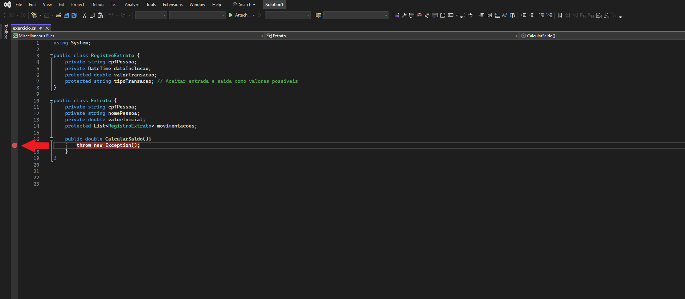
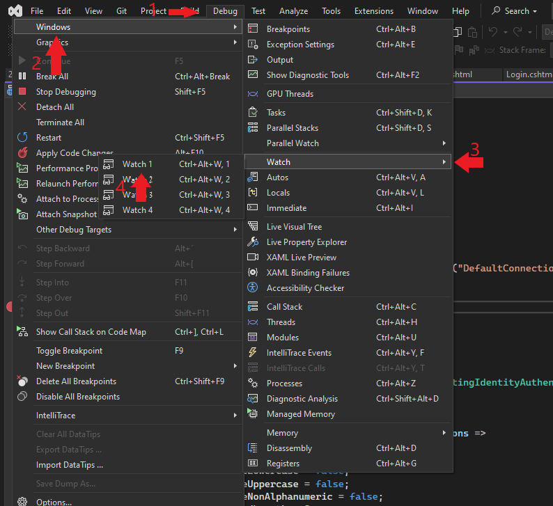
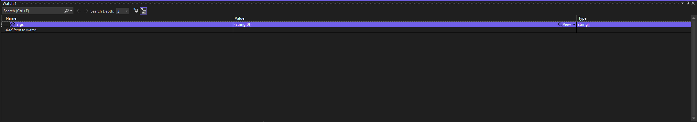
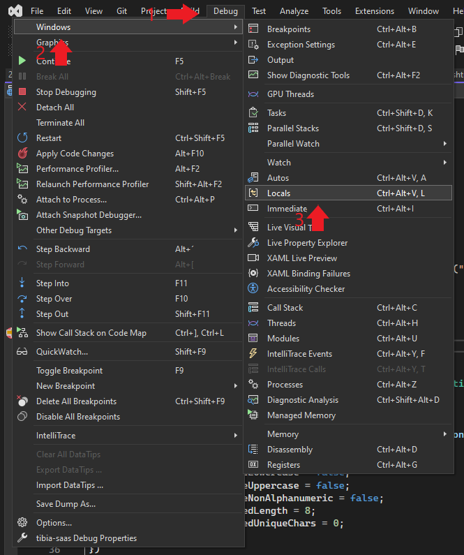
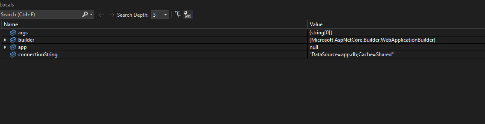
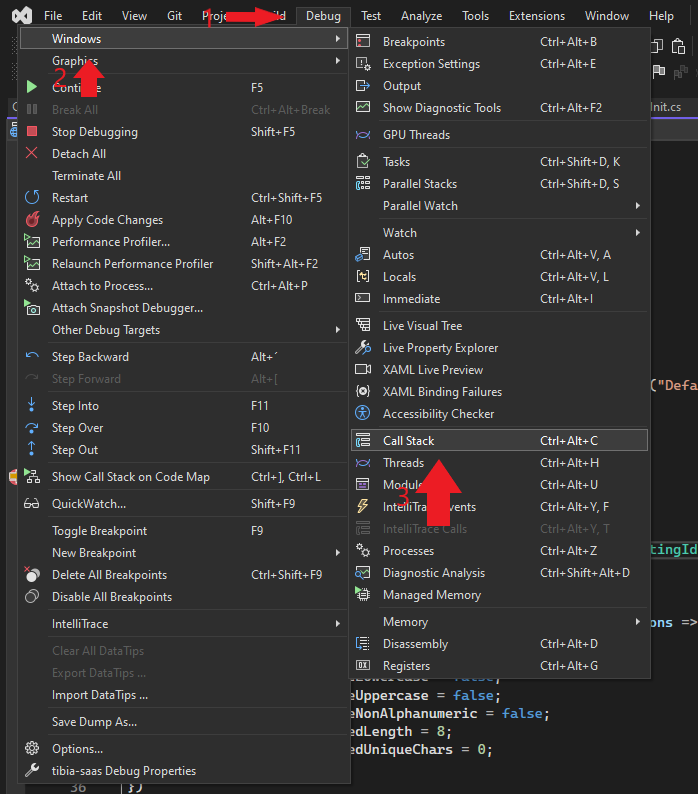
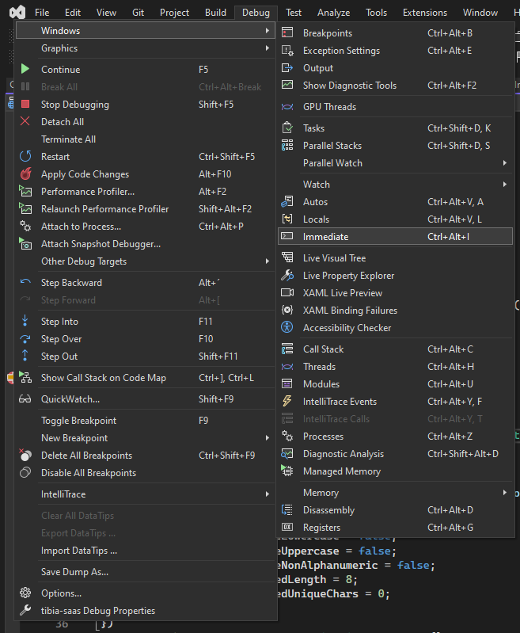
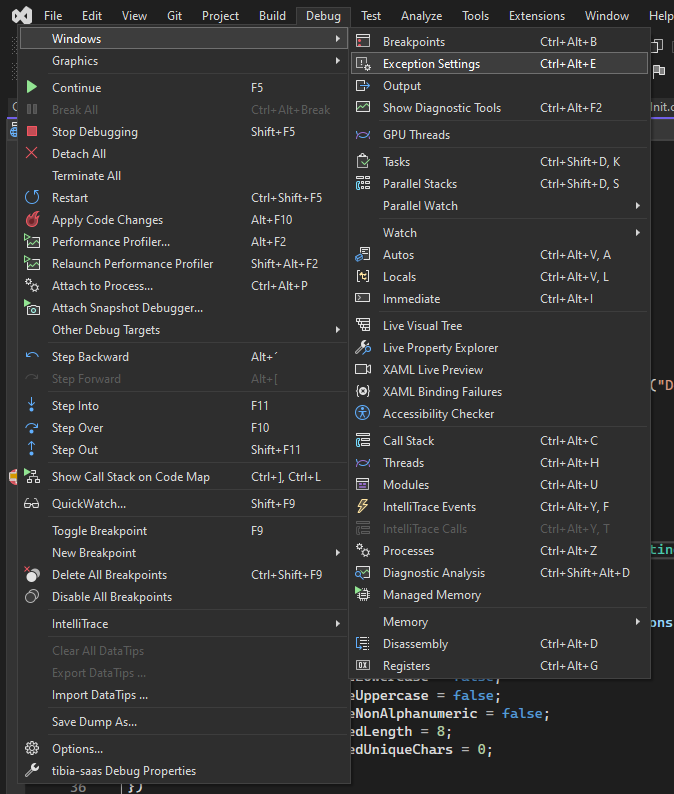
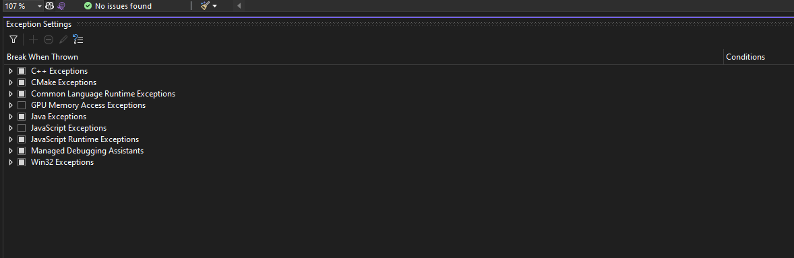

Aqui está um guia básico sobre **Ferramentas de Depuração no Visual Studio**, com descrições e exemplos de uso para cada uma. Visual Studio oferece diversas ferramentas poderosas para identificar e corrigir erros no código.

### 1. **Breakpoints (Pontos de Interrupção)**

**Breakpoints** são usados para pausar a execução do código em um ponto específico para que você possa inspecionar variáveis e a lógica em tempo real.

- **Como adicionar um breakpoint**: Clique na margem esquerda ao lado de uma linha de código ou pressione `F9` enquanto estiver sobre a linha.

- **Exemplo de Uso**:
  Imagine que você quer verificar o valor de uma variável `saldo` em um método de transação. Coloque um breakpoint na linha onde o valor de `saldo` é atualizado.

- **Resultado**:
  O código vai parar nessa linha e você poderá verificar o valor de variáveis locais e o estado da aplicação.

---

### 2. **Watch Window (Janela de Observação)**

A **Watch Window** permite monitorar o valor de variáveis específicas durante a execução.

- **Como usar**: Enquanto o código está em pausa, clique com o botão direito sobre a variável que deseja observar e selecione "Add to Watch" ou use a janela **Watch** (`Debug > Windows > Watch > Watch 1`).

- **Exemplo de Uso**:
  Adicione a variável `saldo` à Watch Window para acompanhar seu valor durante a execução de uma transação.

---

### 3. **Locals Window (Janela de Variáveis Locais)**

A **Locals Window** exibe automaticamente todas as variáveis locais e seus valores no momento da execução do código.

- **Como usar**: No modo de depuração, vá para `Debug > Windows > Locals` para abrir a janela.

- **Exemplo de Uso**:
  Use a janela **Locals** para ver as variáveis de um método de `Transacao` quando a execução parar em um breakpoint.

---

### 4. **Call Stack (Pilha de Chamadas)**

A **Pilha de Chamadas** mostra a sequência de métodos que foram chamados até o ponto atual no código.

- **Como usar**: No modo de depuração, abra a janela **Call Stack** (`Debug > Windows > Call Stack`).

- **Exemplo de Uso**:
  Quando o programa falha, verifique a **Call Stack** para entender como o programa chegou a um determinado ponto e para encontrar a origem do erro.

---

### 5. **Immediate Window (Janela Imediata)**

A **Immediate Window** permite que você execute comandos de C# diretamente durante a depuração.

- **Como usar**: Vá para `Debug > Windows > Immediate` para abrir a janela. Digite expressões e comandos e pressione `Enter`.

- **Exemplo de Uso**:
  Se quiser verificar o valor de `saldo` ou modificar variáveis durante a depuração, você pode fazer isso na **Immediate Window**.

---

### 6. **Exception Settings (Configurações de Exceção)**

As **Configurações de Exceção** permitem que você controle como as exceções são tratadas durante a depuração, configurando para que a depuração pause sempre que uma exceção for lançada, seja capturada ou não.

- **Como usar**: Abra as Configurações de Exceção com `Debug > Windows > Exception Settings`.

- **Exemplo de Uso**:
  Se você quiser depurar uma exceção personalizada como `TipoRegistroInvalidoException`, adicione essa exceção às configurações e configure o Visual Studio para pausar quando ela for lançada.

---

### 7. **Step Into, Step Over, Step Out (Avançar Linha a Linha)**

Essas são três ferramentas essenciais para controlar a execução do código durante a depuração.

- **Step Into (F11)**: Executa a linha atual e, se for uma função, entra nela para depurar o código da função.
- **Step Over (F10)**: Executa a linha atual sem entrar em funções, continuando na próxima linha.
- **Step Out (Shift + F11)**: Sai da função atual e retorna para a função chamadora.

- **Exemplo de Uso**:
  Ao depurar o método `Transacao`, use `Step Into` para entrar em um método que está sendo chamado, ou `Step Over` para pular funções e ver o que acontece em seguida.

---