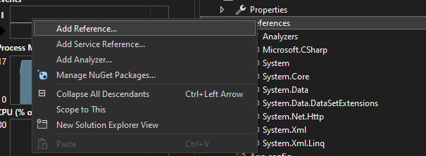
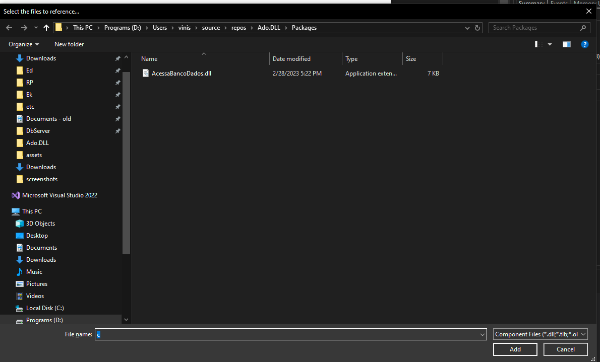

## Classe `AcessoBancoDados`: Gerenciamento de Acesso a Bancos de Dados com OleDb

A classe `AcessoBancoDados` apresentada é um componente essencial para realizar operações de acesso a bancos de dados usando o provedor **OleDb** no .NET. Ela implementa a interface `IDisposable`, o que permite o gerenciamento adequado dos recursos, como conexões e transações com o banco de dados, garantindo que sejam liberados corretamente.

#### Principais Funcionalidades:
- **Gerenciamento de Conexões**: A classe permite abrir, fechar e gerenciar transações com o banco de dados.
- **Execução de Comandos SQL**: Facilita a execução de instruções SQL como `INSERT`, `DELETE`, além de consultas (`SELECT`).
- **Transações**: Suporta o início de transações, com commit e rollback.
- **Uso de Provedor OleDb**: Compatível com bancos de dados que utilizam o provedor OleDb, como Microsoft Access.


## Importando DLL

1. Baixar/Copiar `PATH` os arquivos AcessaBancoDados.zip.
2. Criar uma pasta na raiz do ProjetoBanco chamada Packages.

3. Extrair o conteúdo do arquivo AcessaBancoDados.zip na pasta Packages.
4. Adicione a referência ao arquivo, no ProjetoBanco.Dados, `References -> Add Reference -> Browse` selecione `AcessaBancoDados.dll` clique em `OK`




### Estrutura e Propriedades da Classe

#### 1. **Propriedades Internas e Privadas**

- `Connection`: Representa a conexão com o banco de dados, utilizando a classe `OleDbConnection` do .NET.
- `database`: Caminho do arquivo de banco de dados a ser utilizado.
- `providerName`: Define o nome do provedor OleDb (exemplo: "Microsoft.Jet.OLEDB.4.0").
- `connectionString`: A string de conexão que será construída dinamicamente com base no banco de dados e no provedor.
- `transacoes`: Controla o número de transações ativas (iniciadas).
- `transacao`: Representa a transação atual (`OleDbTransaction`), permitindo commits ou rollbacks.

#### 2. **Construtores**
A classe possui dois construtores que permitem a inicialização com o nome do banco de dados ou com o banco de dados e o provedor especificado.

- **Construtor com banco de dados:**

```csharp
public AcessoBancoDados(string database)
{
    try
    {
        this.database = database;
        Connection = new OleDbConnection();
    }
    catch (Exception ex)
    {
        throw ex;
    }
}
```

- **Construtor com banco de dados e provedor:**

```csharp
public AcessoBancoDados(string database, string provider)
{
    try
    {
        this.database = database;
        providerName = provider;
        Connection = new OleDbConnection();
    }
    catch (Exception ex)
    {
        throw ex;
    }
}
```

#### 3. **Métodos Públicos**
Os métodos da classe proporcionam o controle do acesso ao banco de dados e a execução de comandos.

##### 3.1 **Abrir**
O método `Abrir` estabelece a conexão com o banco de dados e inicia uma transação:

```csharp
public void Abrir()
{
    try
    {
        if (Connection.State != ConnectionState.Open)
        {
            if (!File.Exists(database))
            {
                throw new FileNotFoundException($"Arquivo {database} não encontrado");
            }

            connectionString = $"Provider={providerName};Data Source={database}";
            Connection.ConnectionString = connectionString;
            Connection.Open();
            transacao = Connection.BeginTransaction();
        }
    }
    catch (Exception ex)
    {
        throw ex;
    }
}
```

- Verifica se o arquivo do banco de dados existe antes de tentar abrir a conexão.
- Inicializa uma transação após abrir a conexão.

##### 3.2 **EfetivarComandos**
Este método realiza o `commit` da transação ativa, confirmando as alterações feitas no banco de dados:

```csharp
public void EfetivarComandos()
{
    if (Connection != null)
    {
        if (transacao != null)
        {
            transacao.Commit();
        }

        transacao = null;
    }
}
```

##### 3.3 **Dispose**
O método `Dispose` é fundamental para garantir que os recursos sejam liberados corretamente. Ele faz rollback de transações pendentes e fecha a conexão:

```csharp
public void Dispose()
{
    if (Connection != null)
    {
        if (transacao != null)
        {
            transacao.Rollback();
        }

        Connection.Dispose();
    }
}
```

##### 3.4 **ExecutarInsert e ExecutarDelete**
Esses métodos são usados para executar comandos de inserção e exclusão de registros no banco de dados.

- **ExecutarInsert**:

```csharp
public bool ExecutarInsert(string sql)
{
    int num = ExecutaSQL(sql);
    if (num != 1)
    {
        throw new BancoDadosException("Inclusão no banco de dados retornou 0 (zero) registros.");
    }

    return true;
}
```

- **ExecutarDelete**:

```csharp
public bool ExecutarDelete(string sql)
{
    int num = ExecutaSQL(sql);
    if (num < 0)
    {
        throw new BancoDadosException("Inclusão no banco de dados retornou 0 (zero) registros.");
    }

    return true;
}
```

Ambos os métodos utilizam o método privado `ExecutaSQL` para executar as instruções SQL e verificam se as operações afetaram o número correto de registros.

##### 3.5 **Consultar**
Este método permite realizar consultas ao banco de dados, retornando uma lista de resultados (`List<Linha>`), onde cada `Linha` contém os campos recuperados:

```csharp
public List<Linha> Consultar(string sql)
{
    try
    {
        List<Linha> list = new List<Linha>();
        OleDbCommand oleDbCommand = new OleDbCommand();
        oleDbCommand.Connection = Connection;
        oleDbCommand.Transaction = transacao;
        oleDbCommand.CommandText = sql;
        oleDbCommand.CommandType = CommandType.Text;
        using (OleDbDataReader oleDbDataReader = oleDbCommand.ExecuteReader())
        {
            while (oleDbDataReader.Read())
            {
                Linha linha = new Linha();
                for (int i = 0; i < oleDbDataReader.FieldCount; i++)
                {
                    linha.Campos.Add(new Campo(oleDbDataReader.GetName(i).ToUpper(), oleDbDataReader.GetValue(i)));
                }

                list.Add(linha);
            }

            oleDbDataReader.Close();
        }

        return list;
    }
    catch (Exception ex)
    {
        throw ex;
    }
}
```

#### 4. **Métodos Privados**
##### **ExecutaSQL**
Método privado responsável por executar comandos SQL genéricos como `INSERT`, `UPDATE` ou `DELETE`:

```csharp
private int ExecutaSQL(string sql)
{
    if (Connection == null)
    {
        throw new BancoDadosException("Não é possível executar comandos SQL com a base de dados fechada!");
    }

    OleDbCommand oleDbCommand = new OleDbCommand();
    oleDbCommand.Connection = Connection;
    oleDbCommand.Transaction = transacao;
    oleDbCommand.CommandText = sql;
    oleDbCommand.CommandType = CommandType.Text;
    return oleDbCommand.ExecuteNonQuery();
}
```

### Vantagens do Design da Classe

1. **Uso de Transações**: A classe suporta transações, permitindo que as operações sejam atomizadas, com suporte para commits e rollbacks.
2. **Abstração do Banco de Dados**: A classe encapsula detalhes da conexão e execução de comandos, facilitando o uso do banco de dados sem expor a complexidade da API `OleDb`.
3. **Implementação de `IDisposable`**: O uso da interface `IDisposable` garante que os recursos sejam corretamente liberados após o uso, evitando vazamentos de memória e conexões pendentes.

### Considerações sobre a Classe

- **Exceções Relevantes**: A classe lança exceções personalizadas como `BancoDadosException`, ajudando a identificar problemas específicos no banco de dados.
- **Design Sólido**: O design da classe é robusto, encapsulando corretamente os detalhes da conexão e comando SQL, com suporte para transações e gerenciamento de conexão.