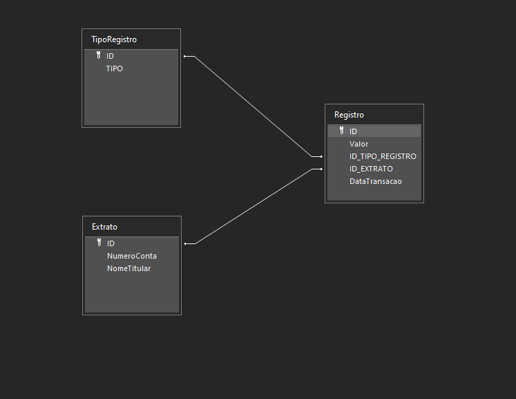

Para criar um repositório de CRUD com base na classe `AcessoBancoDados`, podemos construir um repositório que utilize os métodos já presentes na classe e criar as operações de `Create`, `Read`, `Update` e `Delete` para a entidade `Extrato`.

### Configuração

Baixar o banco de dados ACCESS (Ado.mdb), que contem a seguinte extrutura.



### Passos:

1. **Definir a Entidade `Extrato`**:
   A entidade será uma classe simples que mapeia as propriedades que temos no banco de dados.

2. **Criar o Repositório**:
   O repositório será responsável por realizar as operações CRUD no banco de dados, utilizando os métodos de execução SQL disponíveis na classe `AcessoBancoDados`.


### 1. Definição da Entidade `Extrato` e rever IRepository ( Remover o metodo ObterPor(Func<t,bool>)) e criar uma extenssão para usarmos no metodo Adicionar e Atualizar com parametros.

```csharp
public class Extrato
{
    public int Id { get; set; } // Gerado pelo banco
    public string NumeroConta { get; set; }
    public string NomeTitular { get; set; }
}

public interface IRepositorio<T>
{
    void Adicionar(T item);
    T ObterPorId(int id);
    IEnumerable<T> ObterTodos();
    void Atualizar(T item);
    void Deletar(int id);
}

public static class SqlCommandExtession
{
    public static string GetGeneratedQuery(this SqlCommand dbCommand)
    {
        var query = dbCommand.CommandText;
        foreach (SqlParameter parameter in dbCommand.Parameters)
        {
            if (parameter.DbType == System.Data.DbType.String)
                query = query.Replace(parameter.ParameterName, $"'{parameter.Value.ToString()}'");
            else
                query = query.Replace(parameter.ParameterName, parameter.Value.ToString());
        }

        return query;
    }
}


```

### 2. Repositório de CRUD para `Extrato`

```csharp
public class ExtratoRepository : IRepositorio<Extrato>
{
    private readonly AcessoBancoDados _acessoBancoDados;

    public ExtratoRepository(string database)
    {
        _acessoBancoDados = new AcessoBancoDados(database);
    }

     public void Adicionar(Extrato extrato)
    {
        try
        {
            _acessoBancoDados.Abrir();

            string sql = "INSERT INTO Extrato (NumeroConta, NomeTitular) VALUES (@NumeroConta, @NomeTitular)";

            // Passando parâmetros de forma segura
            SqlCommand command = new SqlCommand(sql);
            command.CommandType = CommandType.Text;

            var numero = new SqlParameter("@NumeroConta", System.Data.DbType.String);
            numero.Value = extrato.NumeroConta;

            var nomeTitular = new SqlParameter("@NomeTitular", System.Data.DbType.String);
            nomeTitular.Value = extrato.NomeTitular;


            command.Parameters.Add(numero);
            command.Parameters.Add(nomeTitular);
            
            _acessoBancoDados.ExecutarInsert(command.GetGeneratedQuery());
            _acessoBancoDados.EfetivarComandos();

        }
        catch (Exception ex)
        {
            throw new Exception("Erro ao inserir extrato: " + ex.Message);
        }
        finally
        {
            _acessoBancoDados.Dispose();
        }
    }

    public Extrato ObterPorId(int id)
    {
        try
        {
            _acessoBancoDados.Abrir();

            string sql = $"SELECT * FROM Extrato WHERE Id = {id}";
            var resultado = _acessoBancoDados.Consultar(sql);

            if (resultado.Count > 0)
            {
                var linha = resultado[0];
                var extrato = new Extrato
                {
                    Id = Convert.ToInt32(linha.Campos.Find(campo => campo.Nome == "ID").Conteudo),
                    NumeroConta = linha.Campos.Find(campo => campo.Nome == "NUMEROCONTA").Conteudo.ToString(),
                    NomeTitular = linha.Campos.Find(campo => campo.Nome == "NOMETITULAR").Conteudo.ToString(),
                };
                return extrato;
            }
            else
            {
                throw new Exception("Extrato não encontrado.");
            }
        }
        catch (Exception ex)
        {
            throw new Exception("Erro ao consultar extrato: " + ex.Message);
        }
        finally
        {
            _acessoBancoDados.Dispose();
        }
    }

    public List<Extrato> ObterTodos()
    {
        try
        {
            _acessoBancoDados.Abrir();

            string sql = "SELECT * FROM Extrato";
            var resultado = _acessoBancoDados.Consultar(sql);

            List<Extrato> extratos = new List<Extrato>();

            foreach (var linha in resultado)
            {
                Extrato extrato = new Extrato
                {
                    Id = Convert.ToInt32(linha.Campos.Find(campo => campo.Nome == "ID").Conteudo),
                    NumeroConta = linha.Campos.Find(campo => campo.Nome == "NUMEROCONTA").Conteudo.ToString(),
                    NomeTitular = linha.Campos.Find(campo => campo.Nome == "NOMETITULAR").Conteudo.ToString(),
                };

                extratos.Add(extrato);
            }

            return extratos;
        }
        catch (Exception ex)
        {
            throw new Exception("Erro ao consultar extratos: " + ex.Message);
        }
        finally
        {
            _acessoBancoDados.Dispose();
        }
    }

    public void Atualizar(Extrato extrato)
    {
        try
            {
                _acessoBancoDados.Abrir();

                string sql = $"UPDATE Extrato SET NumeroConta = @NumeroConta, NomeTitular = @NomeTitular WHERE Id = @Id";

                SqlCommand command = new SqlCommand(sql);
                command.CommandType = CommandType.Text;

                var numero = new SqlParameter("@NumeroConta", System.Data.DbType.String);
                numero.Value = extrato.NumeroConta;

                var nomeTitular = new SqlParameter("@NomeTitular", System.Data.DbType.String);
                nomeTitular.Value = extrato.NomeTitular;

                var id = new SqlParameter("@Id", System.Data.DbType.Int32);
                id.Value = extrato.Id;

                command.Parameters.Add(numero);
                command.Parameters.Add(nomeTitular);
                command.Parameters.Add(id);

                _acessoBancoDados.ExecutarInsert(command.GetGeneratedQuery());
                _acessoBancoDados.EfetivarComandos();
            }
            catch (Exception ex)
            {
                throw new Exception("Erro ao atualizar extrato: " + ex.Message);
            }
            finally
            {
                _acessoBancoDados.Dispose();
            }
    }

    public void Deletar(int id)
    {
        try
        {
            _acessoBancoDados.Abrir();

            string sql = $"DELETE FROM Extrato WHERE Id = {id}";
            _acessoBancoDados.ExecutarDelete(sql);
            _acessoBancoDados.EfetivarComandos();
        }
        catch (Exception ex)
        {
            throw new Exception("Erro ao deletar extrato: " + ex.Message);
        }
        finally
        {
            _acessoBancoDados.Dispose();
        }
    }
}
```

### Explicação:

#### Métodos CRUD:

1. **Inserir**:
   - Realiza um comando SQL `INSERT` para adicionar um novo extrato ao banco de dados.
   - Verifica se a inserção foi bem-sucedida usando o método `ExecutarInsert`.

2. **Obter**:
   - Faz uma consulta no banco de dados com base no `Id` e retorna o extrato correspondente, mapeando os dados para a entidade `Extrato`.

3. **ObterTOdos**:
   - Realiza um `SELECT *` para buscar todos os extratos da tabela e retorna uma lista de objetos `Extrato`.

4. **Atualizar**:
   - Realiza um comando `UPDATE` no banco de dados para atualizar os dados de um extrato com base no `Id`.

5. **Deletar**:
   - Exclui um registro de extrato no banco de dados com base no `Id` fornecido.

### Considerações:

- O repositório utiliza a classe `AcessoBancoDados` para gerenciar a conexão, transações e execução dos comandos SQL.
- **Transações**: Os métodos garantem que as transações sejam efetuadas com sucesso e revertidas em caso de falha (usando `EfetivarComandos` e `Dispose`).
- **Segurança**: Nos exemplos, as queries SQL estão suscetíveis a ataques de injeção de SQL. Em um ambiente de produção, deve-se utilizar parâmetros em vez de concatenar strings diretamente nas consultas.

### Exemplo de Uso do Repositório:

```csharp

string pathToYourFileMDB = "caminho/para/seu/Ado.mdb";

var repo = new ExtratoRepository(pathToYourFileMDB);

// Inserir um novo extrato
repo.Adicionar(new Extrato { NumeroConta = "12345", NomeTitular = "João da Silva" });

// Consultar extrato por Id
var extrato = repo.ObterPorId(1);
Console.WriteLine($"Conta: {extrato.NumeroConta}, Titular: {extrato.NomeTitular}");

// Consultar todos os extratos
var extratos = repo.ObterTodos();
foreach (var e in extratos)
{
    Console.WriteLine($"Id: {e.Id}, Conta: {e.NumeroConta}, Titular: {e.NomeTitular}");
}

// Atualizar um extrato
extrato.NomeTitular = "João da Silva Atualizado";
repo.Atualizar(extrato);

// Deletar um extrato
repo.Deletar(1);
```